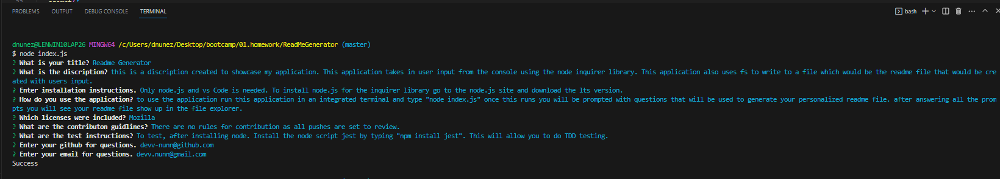
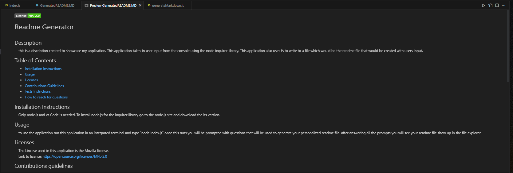
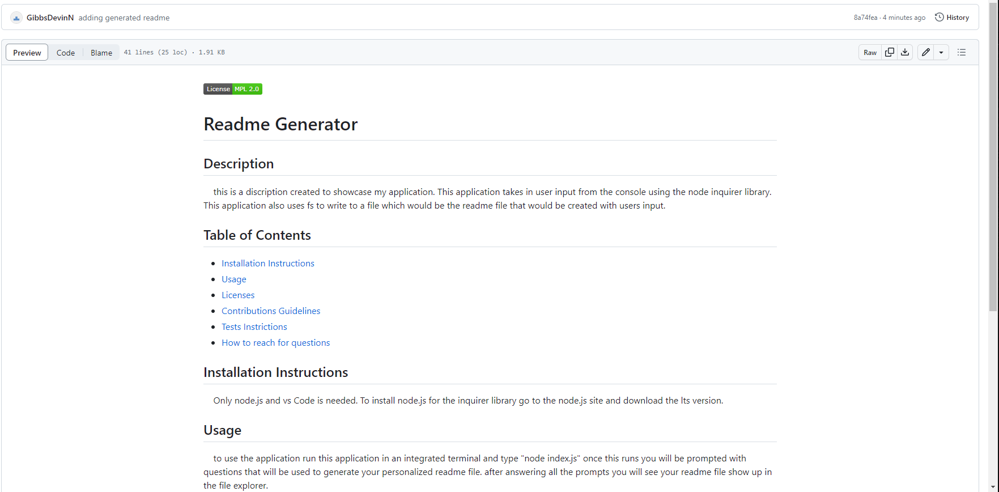

# README.MD File Generator

## Author

Devin Nunez

Email: devv-nunn@gmail.com
git: https://github.com/devv-nunn

## Description

In this project we will generate a professional read me file. using javascript and the node.js library inquirer. Inquirer will allow us to store questions, display them on to the console one by one and stores the answers.  

Inquirer has two parts. Prompt in which we went over stores the questions and the answers. Next will be the .then will take the responses and push them into a write file method.

within the writefile function. their are two perameters. The name of the file you want to write to and the data.

For the data section we refer to another file called generated markdown witch will take in the response and plug it into the right areas of the generated readme. The reason for this is to keep code orginized by having all the text of the readme in a seperate file. 

In this project we learned about the node library called inquirer and also I have learned about the import keyword called require which will allow us to take modules(functions) from another file by having the other file export its modules(functions) to your main file.

## Table of Contents (Optional)

N/a

## Installation

- vs.code and node.js must be installed to use this applicationn

- Clone the following repository after installing vs.code and node.js and run index.html in integrated terminal.

## Usage

To use this application write "node index.js" this will start a series of questions in the command line which will then be used to fill dynamic areas of the read me file: name, title, discription etc...

After answering all the questions needed to generate the readme file you will notice a new readme file pop up in the file explorer. This is the Readme generated by our application.

## Videos Demonstrating application:

Table of contents showcase:
https://drive.google.com/file/d/1kshl7OMiItqJV28xPVHjw4GpBXaipAzi/view

application functionality showcase:
https://drive.google.com/file/d/16km-5pONA6Og9bzfQDNFYe9a5YQ4Qbtl/view

## Deployment

Repo: https://github.com/devv-nunn/ReadMeGenerator

# Tech Stack

HTML
CSS
JavaScript
node.js

## Credits

N/a

## License

MIT License.